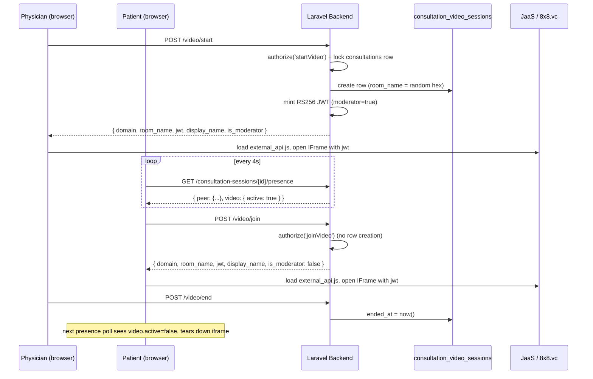

# Jitsi API Implementation

## 1. Overview

Telemed integrates video calling into its existing consultation workflow using **Jitsi as a Service (JaaS)** — the hosted 8x8 offering of Jitsi Meet, not a self-hosted Jitsi server and not the public `meet.jit.si`. JaaS was chosen specifically because it supports server-issued JWT authentication, which is a hard requirement here: an unauthenticated Jitsi room is joinable by anyone who guesses the room name, and a telemedicine consultation cannot allow that.

Video is not a parallel feature bolted onto the app — it is a capability of an already-`active` `ConsultationSession` ([app/Models/ConsultationSession.php](../app/Models/ConsultationSession.php)). The existing consultation lifecycle (`consultation_status`, `request_status`) remains the sole source of truth for whether video is allowed; there is deliberately no separate video status machine. A dedicated `consultation_video_sessions` table records *when* a room existed and whether it is still open, not *whether* the surrounding consultation permits it.

**Division of responsibility:**

- **Laravel backend** — owns every decision that matters: who may start a room, who may join it, who may end it, room-name generation, and JWT minting (including loading and signing with the RSA private key). The signing key never leaves the server.
- **Blade + Alpine.js frontend** — renders the Start/Join/End affordances, polls existing presence infrastructure to learn when a room is live, and boots the Jitsi IFrame using only the values an authorized backend response supplied. The frontend never decides who is allowed to do anything; every button click still round-trips through backend authorization.

## 2. Architecture



- **Patient / Physician** — the two roles that can touch video. Nurses are excluded (see §9).
- **Consultation / ConsultationSession** — the pre-existing two-table model (`Consultation` = patient-facing request, `ConsultationSession` = clinical session). Video sessions hang off `ConsultationSession.id`, never off the request.
- **JWT authentication** — minted server-side per join, never stored, never reused across rooms.
- **Frontend video interface** — the Blade view's Alpine component, `consultationMessaging()`.

## 3. Technology and Dependencies

| Technology | Purpose | Where |
|---|---|---|
| **JaaS (8x8.vc)** | Hosted Jitsi Meet with JWT-gated rooms | external service |
| **Jitsi Meet IFrame API** (`external_api.js`) | Embeds the video call in the page | loaded dynamically from JaaS, not bundled |
| PHP `openssl_sign` / `openssl_pkey_get_private` (ext-openssl, PHP built-in) | RS256 signing of the JWT | [app/Services/JitsiService.php](../app/Services/JitsiService.php) |
| Laravel `DB::transaction` + `lockForUpdate()` | Concurrency control for room creation/closure | [app/Services/ConsultationVideoService.php](../app/Services/ConsultationVideoService.php) |
| Laravel Policies (`Illuminate\Auth\Access`) | Authorization gating | [app/Policies/ConsultationSessionPolicy.php](../app/Policies/ConsultationSessionPolicy.php) |
| Alpine.js (already a project dependency) | Frontend reactivity, no new library | [resources/views/consultations/messaging.blade.php](../resources/views/consultations/messaging.blade.php) |
| jQuery + SweetAlert2 (already loaded via CDN in the layout) | AJAX calls and error dialogs, matching the rest of the page | same file |

**No JWT library, no Jitsi SDK, and no new Composer or npm package was added.** `composer.json` and `package.json` are unchanged by this feature — confirmed by inspection; neither file contains a Jitsi-related entry. JWT construction is ~30 lines of manual base64url encoding plus PHP's built-in OpenSSL functions, and the IFrame API is loaded at runtime via a dynamically injected `<script>` tag rather than a bundled dependency.

## 4. Configuration

Environment variables ([.env.example](../.env.example)):

```env
# Jitsi as a Service (JaaS / 8x8) — video consultations.
# Credentials come from the JaaS console: https://jaas.8x8.vc/#/apikeys
# Never commit real values.
JITSI_DOMAIN=8x8.vc
JITSI_APP_ID=
JITSI_API_KEY_ID=
# RSA private key on a single line, with newlines escaped as literal \n
JITSI_PRIVATE_KEY=<JITSI_PRIVATE_KEY>
```

Mapped in [config/services.php](../config/services.php):

```php
'jitsi' => [
    'domain'      => env('JITSI_DOMAIN', '8x8.vc'),
    'app_id'      => env('JITSI_APP_ID'),
    'api_key_id'  => env('JITSI_API_KEY_ID'),
    'private_key' => str_replace('\n', "\n", (string) env('JITSI_PRIVATE_KEY')),
    'jwt_ttl'     => 1800,
],
```

| Variable | Consumed by | Backend-only or frontend-exposed | Required |
|---|---|---|---|
| `JITSI_DOMAIN` | `JitsiService::domain()` | Sent to the frontend as `domain` in every start/join response (it is public — it's just the JaaS host) | Yes (defaults to `8x8.vc`) |
| `JITSI_APP_ID` | `JitsiService::issueToken()` (JWT `sub`), `JitsiService::iframeRoomName()` | Reaches the frontend only indirectly, embedded inside `room_name` (`{app_id}/{room}`) in an authorized response — never sent standalone, never hard-coded in Blade/JS | Yes |
| `JITSI_API_KEY_ID` | `JitsiService::issueToken()` (JWT header `kid`) | **Backend-only.** Never sent to the browser in any form | Yes |
| `JITSI_PRIVATE_KEY` | `JitsiService::sign()` | **Backend-only, most sensitive value in the system.** Never sent to the browser, never logged | Yes |

`jwt_ttl` (1800 seconds / 30 minutes) is a plain constant in `config/services.php`, not an environment variable — it needs no per-environment tuning, and tokens are minted fresh on every join, so a short TTL costs nothing (rejoining just mints a new one).

All four values are read exclusively through `config('services.jitsi.*')`, never via a raw `env()` call inside application code, which is what keeps the configuration correct after `php artisan config:cache`.

## 5. JaaS / Jitsi Credentials

| Credential | Role in the JWT | Notes |
|---|---|---|
| App ID (`vpaas-magic-cookie-…`) | `sub` claim; also the path prefix on `room_name` and on the `external_api.js` script URL | Not secret, but never hard-coded — always read from config or from an authorized response |
| API Key ID | `kid` header, used verbatim | Identifies which uploaded public key JaaS should verify the signature against |
| Private key (RSA, PEM) | Signs the token | **Never leaves the server.** No public key is stored or used by this application — the corresponding public key lives in the JaaS console, uploaded separately when the API key was created |
| Signing algorithm | `RS256` | Matches JaaS's documented requirement (`https://developer.8x8.com/jaas/docs/api-keys-jwt`) — verified against the live docs before implementation, not assumed |
| Token expiration | `exp` = mint time + 1800s; `nbf` = mint time − 10s | The 10-second backdating absorbs clock skew between the server and JaaS, matching 8x8's own reference sample |

### Actual JWT claim structure generated by the code

Header ([JitsiService.php:67-71](../app/Services/JitsiService.php#L67-L71)):

```json
{
  "alg": "RS256",
  "kid": "<JITSI_API_KEY_ID>",
  "typ": "JWT"
}
```

Payload ([JitsiService.php:73-86](../app/Services/JitsiService.php#L73-L86)):

```json
{
  "aud": "jitsi",
  "iss": "chat",
  "sub": "<JITSI_APP_ID>",
  "room": "3f9a1c7e05b84d2699af1c0e7b3d5a84",
  "nbf": 1755000000,
  "exp": 1755001800,
  "context": {
    "user": {
      "name": "Dr. Reyes",
      "moderator": "true"
    }
  }
}
```

Notes on claims that were deliberately **not** included: no `context.features` block (recording/livestreaming/transcription/outbound-call permissions) — JaaS documents this as optional, and none of those capabilities are used by this implementation. No `context.user.email`, `.avatar`, or `.id` — only the display name and moderator flag are needed, and sending an email or user id into a third-party JWT would be an unnecessary PII leak. `moderator` is the **string** `"true"`/`"false"`, matching 8x8's own reference PHP sample rather than the boolean the prose docs use ambiguously (see §20).

## 6. Backend Implementation

| File | Responsibility |
|---|---|
| [app/Services/JitsiService.php](../app/Services/JitsiService.php) | Stateless: room-name generation, JWT minting, PEM normalization. No database access, no authorization decisions. |
| [app/Services/ConsultationVideoService.php](../app/Services/ConsultationVideoService.php) | Owns the video session *lifecycle*: create-or-reuse on start, lookup, close on end. All writes go through a `DB::transaction` + `lockForUpdate()` on the parent `consultations` row. |
| [app/Http/Controllers/ConsultationVideoController.php](../app/Http/Controllers/ConsultationVideoController.php) | HTTP layer: `start()`, `join()`, `end()`. Applies policy checks, calls the two services above, shapes the JSON response the frontend receives. |
| [app/Policies/ConsultationSessionPolicy.php](../app/Policies/ConsultationSessionPolicy.php) | `joinVideo()` and `startVideo()` gates (see §9). |
| [app/Models/ConsultationVideoSession.php](../app/Models/ConsultationVideoSession.php) | Eloquent model for `consultation_video_sessions`. `isActive()` = `ended_at === null`. |
| [app/Models/ConsultationSession.php](../app/Models/ConsultationSession.php) | Adds `videoSessions()` (full history, newest first) and `activeVideoSession()` (the one row with `ended_at IS NULL`, if any) relations. |
| [database/migrations/2026_08_24_120000_create_consultation_video_sessions_table.php](../database/migrations/2026_08_24_120000_create_consultation_video_sessions_table.php) | Schema (see §8). |
| [config/services.php](../config/services.php) | Maps the four `JITSI_*` env vars (§4). |
| [routes/web.php](../routes/web.php) (lines 159–166) | Registers the three video routes (§13). |
| [app/Http/Controllers/ConsultationMessageController.php](../app/Http/Controllers/ConsultationMessageController.php) | `presence()` adds the `video.active` field (§11); `complete()` closes any open video session as the last step of its existing transaction (§10). |

### Key methods

**`JitsiService`**
- `domain(): string` — the configured JaaS host.
- `generateRoomName(): string` — `bin2hex(random_bytes(16))`, 128 bits of entropy, pure lowercase hex.
- `iframeRoomName(string $roomName): string` — `"{app_id}/{roomName}"`, the form the IFrame API's `roomName` option expects.
- `issueToken(string $roomName, string $displayName, bool $isModerator): string` — builds and signs the JWT.

**`ConsultationVideoService`**
- `startForPhysician(ConsultationSession $session, User $physician): ConsultationVideoSession` — locks the parent row, re-verifies the assigned physician and active status *inside* the lock, reuses an existing active row or creates one.
- `activeFor(ConsultationSession $session): ?ConsultationVideoSession` — read-only lookup, no lock, used by `join()`.
- `end(ConsultationSession $session): bool` — locks the parent row, closes the active row if one exists, returns whether anything was closed.

**`ConsultationVideoController`**
- `start(ConsultationSession $session)` — `authorize('startVideo', ...)`, calls `startForPhysician()`, returns the join payload.
- `join(ConsultationSession $session)` — `authorize('joinVideo', ...)`, calls `activeFor()`; if null, returns **409 Conflict** rather than creating a row.
- `end(ConsultationSession $session)` — `authorize('startVideo', ...)`, calls `end()`.
- `joinPayload()` (private) — shapes the exact fields sent to the browser (§13).

## 7. JWT Generation

1. **Trigger** — a `POST` to `/video/start` (physician) or `/video/join` (patient/physician). Nothing mints a token outside those two request handlers; presence polling never triggers minting.
2. **Component** — `JitsiService::issueToken()`, called from `ConsultationVideoController::joinPayload()`.
3. **Private key loading** — `config('services.jitsi.private_key')` is read (never a raw `env()` call), then passed through `JitsiService::normalizePem()` before `openssl_pkey_get_private()`. `normalizePem()` rebuilds the PEM block from its base64 body, discarding any stray whitespace — a real defect found during manual JaaS preflight: escaping a key onto a single `.env` line commonly leaves a blank line just after the `BEGIN` marker, which OpenSSL 3's decoder rejects outright even though the key material is intact. This step alters no key bytes, only whitespace.
4. **Claims generated** — see §5's payload. `nbf`/`exp` are computed from `now()->getTimestamp()`. `context.user.moderator` is set from the `$isModerator` argument, which the controller derives from `$session->physician_id === $user->user_id`, never from client input.
5. **Signing** — `openssl_sign($signingInput, $signature, $privateKey, OPENSSL_ALGO_SHA256)`, i.e. RS256. The signing input is `base64url(header) . '.' . base64url(payload)`.
6. **Expiration handling** — 1800-second TTL from mint time, with a 10-second `nbf` backdate for clock skew. No refresh mechanism exists; a client simply calls `/video/join` again to mint a fresh token (idempotent — it does not create a new room).
7. **Reaching the frontend** — the token is one field (`jwt`) in the JSON response of `/video/start` or `/video/join`. It is never persisted to the database, never included in the presence response, and never logged (`JitsiServiceTest` asserts nothing is written to any log channel during minting).
8. **JaaS's use of the token** — passed as the `jwt` option to `JitsiMeetExternalAPI`'s constructor; JaaS verifies the RS256 signature against the public key that was uploaded to its console when the API key was created, and enforces the `room`/`exp`/`nbf` claims itself.

## 8. Room Naming and Consultation Mapping

- **Identifier used**: `consultation_video_sessions.consultation_id` → `consultations.id`, i.e. the **clinical session's** primary key — not `consultation_requests.request_id`. This naming matches two existing sibling tables that already use `consultation_id` to mean "points at `consultations.id`" (`consultation_messages`, `follow_up_requests`).
- **Generation**: `bin2hex(random_bytes(16))` — 32 lowercase hex characters, no database lookup performed to check uniqueness (the schema's unique constraint is the final arbiter; a collision is not reachable in practice at 128 bits).
- **Deterministic?** No. A fresh room name is generated every time `startForPhysician()` creates a row, which is only when no active row already exists for that `ConsultationSession`.
- **Same room for both roles?** Yes — patient and physician receive the identical `room_name` and `domain` for one active video session; only the `is_moderator` flag (and therefore the JWT's `moderator` claim) differs between them.
- **Different sessions → different rooms?** Yes, always. Because the FK points at `consultations.id`, and every follow-up consultation gets a brand-new `ConsultationSession` row (from both existing follow-up creation paths — [ConsultationOwnershipService.php:462](../app/Services/ConsultationOwnershipService.php#L462) and `PhysicianController::createFollowUpConsultationFromSource`), a follow-up consultation structurally cannot reuse its parent's video row or room. No follow-up-specific code exists for this — it falls out of the schema design.
- **Restrictions against unauthorized joins**: room names carry no patient name, email, user id, consultation id, or other identifying data (they are pure hex), *and* possessing the room name alone is insufficient — JaaS requires a valid RS256 JWT scoped to that exact room via the `room` claim.

Sanitized example: bare room claim `3f9a1c7e05b84d2699af1c0e7b3d5a84`; IFrame `roomName` option `vpaas-magic-cookie-<tenant>/3f9a1c7e05b84d2699af1c0e7b3d5a84`.

## 9. Authorization and Security

| Check | Enforced by | Role reached |
|---|---|---|
| Authenticated | `auth` + `verified` route middleware | all video routes |
| Belongs to this consultation | `ConsultationSessionPolicy::viewMessaging()` → `patient_id` or `physician_id` match | inherited via `sendMessage()`/`joinVideo()` |
| Consultation currently active | `viewMessaging()`'s status check **plus** `sendMessage()`'s stricter `consultation_status === 'active'` check **plus** a third re-check inside `ConsultationVideoService`'s DB lock | defense in depth — three independent checks, not one |
| Only the assigned physician may start/end | `ConsultationSessionPolicy::startVideo()`, re-verified again inside `ConsultationVideoService::startForPhysician()`'s transaction | start, end |
| Patient may only join an existing room | `ConsultationVideoController::join()` returns 409 rather than calling any create path when no active row exists | join |
| Nurse cannot start or join | `viewMessaging()` only ever returns `true` for `role === 'patient'` (owner) or `role === 'physician'` (assigned) — a nurse role fails the very first check | all video routes |

**What Laravel enforces:** every access-control decision above — who may reach an endpoint, who may create a room, who may end it, whether the consultation is in a video-eligible state. **What JaaS enforces:** whether a presented JWT's signature, `room`, `exp`, and `nbf` are valid for the room being joined. The two are cleanly separated: Laravel decides *if* a token should be minted at all; JaaS decides whether a *specific token in hand* may enter a *specific room*.

**JWT and key protection**: the private key is read only from server-side config, normalized in memory, and never appears in a response body, a log line, or a test assertion (`JitsiServiceTest` explicitly asserts this). The `kid` (API Key ID) is likewise backend-only. The presence endpoint ([§11](#11-video-presence--active-state)) is deliberately restricted to a single boolean specifically so that passive polling can never become a credential leak — this was a design requirement, not an incidental property.

**Honest limitation**: once a valid JWT has been issued to an authorized browser, Laravel has no further say over that specific token for its remaining lifetime (up to 30 minutes) — token revocation is not implemented, matching the general nature of short-lived bearer tokens. See §20.

## 10. Consultation Video Workflow

```text
Physician (assigned) or Patient (owner)
      ↓
Consultation must be `active` (consultation_status AND request_status)
      ↓
Policy: startVideo (physician-only) or joinVideo (patient or physician)
      ↓
ConsultationVideoService: lock parent row → create-or-reuse (start) / lookup only (join)
      ↓
JitsiService: mint RS256 JWT scoped to the room
      ↓
Browser: load external_api.js from the JaaS tenant path, open IFrame with the JWT
      ↓
Video consultation in progress
      ↓
Either party disposes their local IFrame ("Leave call") — the room stays open
      ↓
Physician ends the call server-side ("End call for everyone") → ended_at set
      ↓
Patient's next presence poll (≤4s) sees video.active=false → local IFrame torn down
      ↓
Consultation completion (separately) also force-closes any still-open video row
```

- **Who can start**: only the physician assigned to that `ConsultationSession`.
- **Who can join**: the owning patient or the assigned physician, once a room exists. A patient's own `/video/join` call never creates a room.
- **When video becomes available**: the moment the physician's `POST /video/start` commits — reflected to the patient via the next presence poll (≤4 seconds).
- **On join**: the browser mints/receives a fresh JWT and opens the Jitsi IFrame; `is_moderator` gates JaaS moderator controls.
- **On leave (local)**: `jitsiApi.dispose()` — the video row is untouched, the other participant is unaffected, and rejoining is just another `/video/join` call.
- **On end (physician, server-side)**: the `consultation_video_sessions` row's `ended_at` is set; the patient's UI reacts on its next poll.
- **Consultation session state impact**: none, in either direction. Video state never writes to `consultation_status`/`request_status`, and (aside from forced closure on completion) consultation state changes never directly touch the video row outside of the authorization checks that read it.

## 11. Video Presence / Active State

`video.active` (added to the existing presence endpoint's response) means: **"there is currently an open room for this consultation session that the caller could join right now."** It is computed, not stored, in [ConsultationMessageController::presence()](../app/Http/Controllers/ConsultationMessageController.php):

```php
'active' => $session->consultation_status === 'active'
    && $session->activeVideoSession()->exists(),
```

Both conditions matter: the row-existence check alone would allow a stale, never-closed row (which should be structurally impossible given §10, but the extra check costs nothing and removes any dependency on that invariant holding forever).

- **Endpoint**: `GET /consultation-sessions/{session}/presence` — the same endpoint that already served typing/online-status presence before this feature; no new endpoint was introduced (per an explicit design requirement to reuse existing polling rather than add a parallel one).
- **Frontend consumption**: the existing 4-second `fetchPresence()` poll in `messaging.blade.php` reads `data.video.active` and assigns it to Alpine's `videoActive` property. Nothing else in the `video` object is read (verified by test — see §17).
- **On join**: irrelevant to this field — `video.active` reflects room *existence*, not per-user attendance. It does not track who or how many people are actually in the call.
- **On leave**: unaffected unless the room itself closes (physician End); a patient leaving locally does not change `video.active`.
- **What it is not**: not a per-participant presence signal, not an authorization decision (the backend's `/video/join` independently re-verifies everything), and not a count of attendees — there is no participant tracking anywhere in this implementation (§12 note, §20).

## 12. Frontend Integration

- **Blade view**: [resources/views/consultations/messaging.blade.php](../resources/views/consultations/messaging.blade.php) — the single view all video markup and script live in; no separate video page or partial was created.
- **JavaScript**: inline `<script>` inside the same Blade file, inside the existing `consultationMessaging()` Alpine factory function — no separate `.js` file, matching how the rest of the page's behavior (messaging, presence, clinical details) is already structured.
- **IFrame API usage**: `new window.JitsiMeetExternalAPI(domain, { roomName, jwt, parentNode, width, height, configOverwrite: { prejoinPageEnabled: false }, userInfo: { displayName } })`. Only `JitsiMeetExternalAPI` is used — `lib-jitsi-meet` is never referenced anywhere in the codebase.
- **Domain configuration**: the `domain` argument comes solely from an authorized `/video/start` or `/video/join` JSON response; it is never hard-coded in Blade/JS.
- **Room configuration**: `roomName` is the `{appId}/{room}` form returned by the backend (`room_name` field) — the tenant segment for the dynamically-loaded `external_api.js` script URL is derived client-side from that same value (`joinData.room_name.split('/')[0]`), so no additional server field or hard-coded app id was needed.
- **JWT/token passing**: the `jwt` field from the join response is passed straight into the constructor's `jwt` option; it is held only in the Alpine component's in-memory state and is never written to `localStorage`/`sessionStorage`/a cookie.
- **Participant configuration**: `userInfo.displayName` is the server-computed display name (first + last name, or "Participant" as a fallback) — never user-editable free text.
- **Event listeners**: one — `readyToClose`, wired to `leaveVideoCall()` (local iframe disposal).
- **UI behavior**: three conditionally-shown regions — a Start/Join banner (`x-show="!inVideoCall && consultationStatus === 'active' && (isAssignedPhysician || videoActive)"`), a live-call container (`x-show="inVideoCall"`) with "Leave call" (either party) and "End call for everyone" (physician only) buttons, and no video UI at all once the consultation is completed or for a nurse (the banner never renders for a role that fails the backend's authorization anyway).
- **Cleanup/disposal**: `leaveVideoCall()` calls `jitsiApi.dispose()` and clears `inVideoCall`. It fires on explicit "Leave call" clicks, on the `readyToClose` event, and automatically from `fetchPresence()` if `video.active` flips to `false` while the local user is still in a call (i.e. the physician ended it for everyone). It is also explicitly invoked when the consultation is completed, so stale call state cannot survive that transition.

**Sequence from page load to joining**: page loads → `init()` starts the existing message/presence pollers → the patient sees nothing video-related until a presence tick reports `video.active: true` → user clicks Join/Start → `POST` to the relevant endpoint → on a successful JSON response, `startJitsiCall(data)` lazily injects `external_api.js` (once per page load, cached via a promise) → once loaded, `JitsiMeetExternalAPI` is constructed inside the video container ref → `inVideoCall = true`.

**External script loading is lazy, not eager**: `external_api.js` is not a static `<script src>` tag in the page `<head>` — it is only requested after a successful start/join response, at `https://{domain}/{tenant}/external_api.js` (the JaaS-specific tenant-path form; the bare-domain URL 404s, a real defect caught during preflight — see §18).

## 13. Routes and API Endpoints

| Method | Route | Purpose | Authentication | Authorization |
|---|---|---|---|---|
| `POST` | `/consultation-sessions/{session}/video/start` | Create the video session, or reuse the running one | `auth` + `verified` (+ `throttle:30,1`) | `ConsultationSessionPolicy::startVideo` — assigned physician only |
| `POST` | `/consultation-sessions/{session}/video/join` | Return join credentials for an already-running video session | `auth` + `verified` (+ `throttle:30,1`) | `ConsultationSessionPolicy::joinVideo` — owning patient or assigned physician; **409** if no room is running |
| `POST` | `/consultation-sessions/{session}/video/end` | Close the running video session | `auth` + `verified` | `ConsultationSessionPolicy::startVideo` — assigned physician only |
| `GET` | `/consultation-sessions/{session}/presence` | *(pre-existing endpoint, extended)* Returns peer typing/online status plus `video.active` | `auth` + `verified` | `ConsultationSessionPolicy::viewMessaging` |

Route definitions: [routes/web.php:159-166](../routes/web.php#L159-L166) (video routes) and line ~153 (the pre-existing presence route).

Response shape for `start`/`join` (success):

```json
{
  "success": true,
  "domain": "8x8.vc",
  "room_name": "vpaas-magic-cookie-<tenant>/3f9a1c7e05b84d2699af1c0e7b3d5a84",
  "jwt": "<signed RS256 token>",
  "display_name": "Dr. Reyes",
  "is_moderator": true
}
```

## 14. Data Flow

```text
Browser (Start/Join click)
   ↓
Laravel Route (video/start or video/join, auth+verified middleware)
   ↓
ConsultationVideoController
   ↓
Policy (startVideo / joinVideo) — 403 short-circuits here if unauthorized
   ↓
ConsultationVideoService (DB transaction + lockForUpdate on the parent consultations row)
   ↓
JitsiService (room name already exists by this point for join; JWT minted fresh either way)
   ↓
JSON response { domain, room_name, jwt, display_name, is_moderator }
   ↓
Browser (Alpine: startJitsiCall)
   ↓
JaaS (external_api.js constructs the IFrame, verifies the JWT independently)
```

Presence is a parallel, lower-trust data flow: `Browser → GET /presence → ConsultationMessageController::presence() → { video: { active } } → Browser (videoActive state only, drives UI visibility, never authorization)`.

## 15. Environment Setup

1. In the JaaS console (`https://jaas.8x8.vc/#/apikeys`), create an API key. Note the **App ID**, the **API Key ID**, and download the **private key** (PEM).
2. In `.env`, set:
   ```env
   JITSI_DOMAIN=8x8.vc
   JITSI_APP_ID=vpaas-magic-cookie-<your-tenant>
   JITSI_API_KEY_ID=vpaas-magic-cookie-<your-tenant>/<key-id>
   JITSI_PRIVATE_KEY="<PEM contents, newlines escaped as \n>"
   ```
3. No further Laravel configuration is needed — `config/services.php` already maps these four variables.
4. If config caching was ever enabled locally, clear it: `php artisan config:clear` (or re-run `php artisan config:cache` after editing `.env`).
5. Start the app: `composer run dev` (runs `serve` + queue listener + log tailer + `vite` concurrently), or `php artisan serve` plus `npm run dev` separately.
6. As a patient, submit a consultation; as a nurse, approve it; as the physician, start it so the `ConsultationSession` becomes `active`. Open `/consultation-sessions/{id}/messaging`.
7. As the physician, click **Start Video Consultation** — verify the browser prompts for camera/mic and the IFrame loads with no console errors (particularly no 404 on `external_api.js`).
8. As the patient (separate browser/incognito), reload the messaging page within ~4 seconds — verify the **Join Video Consultation** banner appears, then click it and confirm two-way audio/video.

## 16. Production Deployment

- **Environment variables**: all four `JITSI_*` variables must be set in the production environment; there is no working fallback for `JITSI_APP_ID`, `JITSI_API_KEY_ID`, or `JITSI_PRIVATE_KEY` (only `JITSI_DOMAIN` defaults to `8x8.vc`).
- **HTTPS is mandatory**: `getUserMedia` (camera/mic access) is blocked by browsers on insecure origins other than `localhost`. Production must serve the app over HTTPS.
- **Private key security**: store `JITSI_PRIVATE_KEY` the same way any other production secret is stored in this deployment (never committed to git — `.env.example` only ever has a placeholder). Rotating the key invalidates outstanding tokens; the worst case is a mid-call participant needing to rejoin.
- **Laravel config caching**: `php artisan config:cache` is safe with this implementation because every value is read via `config()`, never a raw `env()` call inside `JitsiService` or `ConsultationVideoService` — but the cache **must be rebuilt** after any change to the four `JITSI_*` variables.
- **Frontend asset building**: no build step is required specifically for this feature — `external_api.js` is fetched at runtime from JaaS, not bundled by Vite. The existing `npm run build` step is unaffected.
- **Domain/origin considerations**: the app origin must be permitted to frame JaaS content (JaaS's own `X-Frame-Options`/CSP policy governs this on their side, not this codebase's).
- **Logging/monitoring**: `JitsiService` deliberately writes nothing to any log channel during token minting (verified by test). Errors it does raise (`RuntimeException` for a missing/unparseable key) surface as a **422** from `ConsultationVideoController::start()`'s `catch` block and are not otherwise logged by this feature's own code — only Laravel's default exception handling applies to unexpected errors.
- **Production testing**: because JWT auth requires a real JaaS deployment, the `meet.jit.si` public server **cannot** be used to test this integration — it accepts no tokens. Testing requires actual JaaS credentials in every environment where video is exercised (see §18 for a caught real-world case where valid-looking credentials still failed).

## 17. Testing

All Jitsi/video tests are Pest Feature tests (this project has no browser-level JS test runner — no Jest/Vitest/Playwright/Cypress in `package.json`).

| Test file | Scope |
|---|---|
| [tests/Feature/JitsiConfigTest.php](../tests/Feature/JitsiConfigTest.php) | `services.jitsi.*` config resolves to the expected keys and types. Every assertion compares key names/types/booleans only — never a credential value — so a failing assertion cannot leak a secret. |
| [tests/Feature/JitsiServiceTest.php](../tests/Feature/JitsiServiceTest.php) | JWT header/payload correctness (RS256, `kid`, `aud`, `iss`, `sub`, bare `room` claim vs. the prefixed IFrame form, `exp`/`nbf` under frozen time), moderator vs. non-moderator claims, `context.features` omission, room-name format and 1000-way uniqueness, that no private key or key fragment appears in any client-facing value, that nothing is logged during minting, PEM normalization (a mangled key with a blank line after `BEGIN` still signs correctly), and both credential-failure paths (missing key, unparseable key) raising without naming the value. Signs with a throwaway keypair generated at test time — never the real configured key. |
| [tests/Feature/ConsultationVideoSessionTest.php](../tests/Feature/ConsultationVideoSessionTest.php) | Model/relationship-level: history ordering, `activeVideoSession()` correctness, the parent-row-lock read pattern, room-name uniqueness constraint, cascade delete, and independent rooms for a follow-up vs. its parent. |
| [tests/Feature/ConsultationVideoAccessTest.php](../tests/Feature/ConsultationVideoAccessTest.php) | Full authorization matrix for `start`/`join`/`end`: assigned physician can start; unassigned physician cannot; patient cannot start; patient can join once started; patient gets 409 before start (and creates nothing); cross-patient access denied; nurse denied on both start and join; completed and not-yet-started consultations denied; repeated starts reuse the same room; five sequential starts produce exactly one active row; follow-up gets a different room; physician can end, patient cannot; a new room after ending differs from the old one; all three endpoints require authentication. |
| [tests/Feature/ConsultationCompletionVideoTest.php](../tests/Feature/ConsultationCompletionVideoTest.php) | Completion closes an active video session; completing with no video session creates nothing; the row survives as history with its room name unchanged; completion stays idempotent and does not overwrite an existing `ended_at`; post-completion start/join are rejected; completing one consultation does not close a different consultation's (or an independent follow-up's) active session; a **genuine transaction-rollback test** — a bound service subclass performs the real closure then throws, proving the whole transaction (video closure included) rolls back together. One test (schedule-slot completion alongside video) is **skipped, not passing**, due to a pre-existing SQLite CHECK-constraint gap unrelated to video (documented in §20). |
| [tests/Feature/ConsultationVideoPresenceTest.php](../tests/Feature/ConsultationVideoPresenceTest.php) | `video.active` true/false transitions (no session ever existed, active, ended, completed-with-a-stale-row), a strict scan of the raw response body for any Jitsi credential/identifier (`jwt`, `room_name`, `domain`, `app_id`, `api_key_id`, `private_key`, the literal domain/tenant strings), identical state for patient and physician, nurse still 403, per-consultation isolation, and that the pre-existing `peer` payload shape/values are unchanged. |
| [tests/Feature/ConsultationVideoJoinUiTest.php](../tests/Feature/ConsultationVideoJoinUiTest.php) | Since there is no JS runtime to drive, these are **source/markup assertions** on the server-rendered Blade output (matching this project's existing precedent for testing Alpine-driven UI — see `MobileBottomNavigationTest.php`): `videoActive` defaults to `false` and is never server-seeded; the Join banner is correctly gated and nothing auto-joins from `init()`/`fetchPresence()`; Start/Join/End each post to the real named routes with CSRF headers; `JitsiMeetExternalAPI` is constructed exactly once, only inside the start/join success path, never on page load; `external_api.js` is loaded from the tenant-path URL, never the bare-domain 404 form, and never as a static tag; no Jitsi credential or app identifier appears anywhere in the rendered page; `videoActive` is explicitly reset at the point the consultation is marked completed; an in-progress call is torn down if presence reports the room is no longer active; pre-existing messaging/presence markup is unchanged. |

**Not covered by automated tests** (stated plainly, not hidden): true concurrent (multi-connection) locking behavior — the "concurrent start" test is sequential against SQLite, matching the existing `ConsultationConcurrencyTest.php` pattern, and is explicitly marked with a `ponytail:` comment naming that limitation; actual browser-driven clicking/DOM assertions (no JS test runner exists in this repo); a live round-trip against a real JaaS server (that is what manual testing in §18/§15 step 6-8 is for).

### Manual test checklist

- [ ] Authorized patient joins an already-started room → two-way audio/video, non-moderator UI
- [ ] Authorized physician starts and is placed directly in the room → moderator UI
- [ ] Unauthorized user (wrong patient, wrong physician, or a nurse) hitting `/video/start` or `/video/join` directly → 403
- [ ] Valid, active `ConsultationSession` → all three endpoints behave as documented
- [ ] Invalid/non-existent or completed/scheduled `ConsultationSession` → 403/422, no room created
- [ ] Token generation succeeds against real JaaS credentials (verify via DevTools Network tab — no 401/403 from JaaS on `external_api.js` or on room join)
- [ ] Expired/invalid token behavior — hardest to test manually since tokens are short-lived by design; can be approximated by editing `jwt_ttl` to a very small value temporarily and waiting
- [ ] Two participants join the same room → identical `room_name`, one DB row, both see each other
- [ ] A participant leaves ("Leave call") → the other participant is unaffected, room stays open
- [ ] `video.active` flips true within ~4s of Start, and false within ~4s of End
- [ ] Completing the consultation force-closes any open video row and hides the video UI entirely

## 18. Error Handling and Troubleshooting

| Symptom | Likely cause (specific to this implementation) | How to diagnose |
|---|---|---|
| Jitsi IFrame never appears; console shows a 404 for `external_api.js` | Requesting the bare-domain URL (`https://8x8.vc/external_api.js`) instead of the tenant-path URL JaaS actually serves it from | Confirm `startJitsiCall()` derives `tenant` from `joinData.room_name.split('/')[0]` and that `loadJitsiExternalApi(domain, tenant)` builds `https://${domain}/${tenant}/external_api.js` — this exact bug was caught during this project's own manual preflight (see the commit fixing it) |
| `/video/start` or `/video/join` returns 422 "The configured Jitsi private key could not be parsed" | The PEM in `JITSI_PRIVATE_KEY` has malformed whitespace (most commonly a blank line right after `-----BEGIN...-----`, from escaping the key onto one `.env` line) | `JitsiService::normalizePem()` should already handle this — if the error persists, the value may not be a PEM block at all (missing `BEGIN`/`END` markers, wrong key type). Never print the key while debugging; compare only its structural shape (marker presence, line count) |
| JWT is rejected by JaaS ("invalid token" in the IFrame) | `kid` doesn't match the API Key ID as it exists in the JaaS console, or the `sub`/App ID doesn't match, or the key uploaded to JaaS doesn't correspond to the private key configured here | Verify `JITSI_APP_ID` and `JITSI_API_KEY_ID` are copied verbatim from the JaaS console (the API Key ID is often already in the `{appId}/{hash}` composite form — do not re-concatenate it) |
| Room joins but shows the wrong/blank patient or physician name | `display_name` in the join payload comes from `first_name`/`last_name` on the `User` model — check those fields are populated; the fallback is the literal string "Participant" | Inspect the `/video/start`/`/video/join` JSON response in DevTools |
| "The physician has not started the video consultation yet." (409) when the physician clearly did start it | The presence poll on the patient side may be stale (poll runs every 4s); or the physician's session ended the call between polls | Check `consultation_video_sessions` directly for a row with `ended_at IS NULL` for that `consultation_id` |
| Patient never sees the Join button appear | `consultationStatus !== 'active'` short-circuits `fetchPresence()` entirely (it simply returns without polling) — this is correct behavior for a non-active consultation, not a bug | Confirm the consultation is actually `active` before expecting presence to poll at all |
| Video state looks "stuck" active after the consultation was completed through some path other than the normal complete button | Only `ConsultationMessageController::complete()` closes video sessions; if `consultation_status` was ever forced to `active`/`completed` through a different, unguarded write elsewhere in the codebase (see §20's note on `PhysicianController::activeConsultations()`), the video row's lifecycle could desync from the consultation's | Check whether any code path other than `complete()` writes `consultation_status` directly |
| `config('services.jitsi.*')` returns stale/empty values after editing `.env` in production | Laravel's config cache (`config:cache`) was not rebuilt after the `.env` change | Run `php artisan config:clear` then `php artisan config:cache` (if caching is used) |
| A participant cannot see/hear the other participant despite both showing "joined" | Outside the scope of this application's code — likely a JaaS-side media/network issue (firewall, TURN/STUN reachability) rather than anything in `JitsiService`/`ConsultationVideoService` | Check the JaaS/8x8 status page and browser console for ICE connection errors; this application has no call-quality diagnostics (§20) |

## 19. Security Considerations

**Actually implemented (not just recommended):**
- Private key is read only through `config()`, never `env()` at runtime, never included in any HTTP response, never logged (asserted by test).
- `kid`/API Key ID is likewise backend-only.
- Consultation/session ownership is checked by policy *and* re-checked inside the database transaction, independently, before any JWT is minted.
- Only the assigned physician can start or end a room; a patient's `/video/join` structurally cannot create one.
- Room names carry no PII and are not predictable (128-bit CSPRNG).
- The presence endpoint returns only a boolean — no credential, no room identifier, ever.
- Token TTL is short (30 minutes) and tokens are never persisted or reused across rooms.

**Recommendations that are operational, not code-level, and must be handled outside this repository:**
- Use HTTPS in production (the app itself cannot enforce this from a Laravel policy — it's an infrastructure requirement, noted in §16).
- Never commit a real `.env` — this repo's own `.env.example` already only contains a placeholder.
- Rotate the JaaS private key periodically through the JaaS console.

## 20. Known Limitations

- **No JS-runtime test coverage.** The repository has no Jest/Vitest/Playwright/Cypress dependency, so §17's UI tests verify rendered markup and code structure, not actual browser interaction. This is an honest gap, not a false claim of full coverage.
- **True concurrency is untested.** The "concurrent start" test in `ConsultationVideoAccessTest.php` is sequential (SQLite has no multi-connection concurrency to exercise), matching the pre-existing `ConsultationConcurrencyTest.php` pattern in this codebase. It proves the reuse branch is taken; it does not prove lock behavior under genuinely parallel requests. Marked in-code with a `ponytail:` comment naming the gap and the upgrade path (a MySQL integration test with two connections).
- **No token revocation.** A minted JWT remains valid for up to 30 minutes even if, e.g., the consultation is completed one second after minting. This is inherent to short-lived bearer tokens and was a deliberate scope boundary, not an oversight — see §9.
- **No participant presence/attendance tracking, call-duration recording, recording, transcription, or call-quality analytics.** `video.active` reflects room existence only, never who or how many people are actually in the call. This was an explicit scope boundary for this implementation, not a missing feature.
- **No reconnect-specific handling beyond "call the same endpoint again."** A dropped connection or page refresh is handled by the client simply calling `/video/join` again, which returns the same still-open room and a fresh token; there is no session/heartbeat tracking of in-call presence, no Jitsi webhook integration, and no stale-room auto-expiry cron. The documented failure mode: if every participant simply vanishes without anyone clicking "End call," the row stays `ended_at IS NULL` until the consultation itself is completed, which is what ultimately force-closes it.
- **Pre-existing SQLite/MySQL schema drift affects one video-adjacent test.** `schedule_slots.status`'s SQLite CHECK constraint (`available`, `booked` only) predates this feature and does not include `missed`/`completed`, which MySQL's enum does. This makes `ConsultationMessageController::complete()`'s existing schedule-slot-closing code throw under SQLite for any consultation with a booked slot — unrelated to video logic, but it forces one test in `ConsultationCompletionVideoTest.php` (schedule-slot-closes-alongside-video) to be **skipped on SQLite** rather than pass. It is not fixed as part of this feature; it is recorded as separate technical debt.
- **`CLAUDE.md`'s SQLite-enum-migration note is itself slightly inaccurate** in light of the above: it describes the newer enum values as universally "working fine" under SQLite, which is true for `consultations.consultation_status` (whose CHECK was dropped by a later migration) but not for `schedule_slots.status` (whose original two-value CHECK is still active). Worth correcting in a documentation pass, unrelated to this feature's own code.
- **The `moderator` JWT claim is a string, not a boolean.** 8x8's own prose documentation describes it ambiguously (as Boolean in one place, while their reference PHP sample emits the string `"true"`/`"false"`). This implementation follows the reference sample, which is the safer interpretation, but it has not been independently re-confirmed by a successful live JaaS join in an automated way — only by manual preflight and code-level verification.

## 21. File Reference

| File | Purpose |
|---|---|
| `app/Services/JitsiService.php` | Room-name generation, RS256 JWT minting, PEM normalization |
| `app/Services/ConsultationVideoService.php` | Video session lifecycle (start/reuse, lookup, end), locking |
| `app/Http/Controllers/ConsultationVideoController.php` | `start`/`join`/`end` HTTP endpoints |
| `app/Http/Controllers/ConsultationMessageController.php` | `presence()` (adds `video.active`), `complete()` (force-closes video on completion) |
| `app/Policies/ConsultationSessionPolicy.php` | `joinVideo`/`startVideo` authorization gates |
| `app/Models/ConsultationVideoSession.php` | Eloquent model for `consultation_video_sessions` |
| `app/Models/ConsultationSession.php` | `videoSessions()`/`activeVideoSession()` relations |
| `database/migrations/2026_08_24_120000_create_consultation_video_sessions_table.php` | Schema for `consultation_video_sessions` |
| `config/services.php` | Maps `JITSI_*` env vars under the `jitsi` key |
| `.env.example` | Documents the four required `JITSI_*` variables (placeholders only) |
| `routes/web.php` | Registers `video/start`, `video/join`, `video/end` |
| `resources/views/consultations/messaging.blade.php` | All video UI markup and Alpine.js integration |
| `tests/Feature/JitsiConfigTest.php` | Config mapping tests |
| `tests/Feature/JitsiServiceTest.php` | JWT/room-generation unit-style tests |
| `tests/Feature/ConsultationVideoSessionTest.php` | Model/relationship tests |
| `tests/Feature/ConsultationVideoAccessTest.php` | Authorization + concurrency tests |
| `tests/Feature/ConsultationCompletionVideoTest.php` | Completion-triggered closure tests |
| `tests/Feature/ConsultationVideoPresenceTest.php` | `video.active` presence tests |
| `tests/Feature/ConsultationVideoJoinUiTest.php` | Frontend wiring/markup tests |

## 22. Implementation Summary

Telemed's video consultation feature layers JaaS-backed Jitsi calling onto the existing `ConsultationSession` lifecycle without introducing a parallel workflow or a second state machine. A dedicated `consultation_video_sessions` table (FK'd to `consultations.id`, the clinical session, not the patient-facing request) records room history; `ended_at IS NULL` marks the currently active room, enforced uniquely via parent-row pessimistic locking rather than a database constraint that MySQL cannot express portably.

**Authentication** is Laravel's existing session auth (`auth` + `verified` middleware) for every video route; there is no separate video-specific login. **Authorization** is layered: a policy gate (`startVideo`/`joinVideo`) checked before any service call, re-verified again inside the database transaction that actually creates or closes a room, so a stale authorization decision can never win a race. Only the assigned physician may start or end a call; a patient may only join a room that already exists; nurses are excluded because the underlying `viewMessaging` policy was never built to admit them.

**Room mapping** follows directly from the schema: one `ConsultationSession` can have many historical video rows but at most one active one, and because every follow-up consultation gets its own fresh `ConsultationSession`, follow-ups get independent rooms with zero follow-up-specific video code.

**The frontend** (Alpine.js inside the existing messaging Blade view) never receives a credential except through an authorized request-response cycle: `video.active` on the pre-existing presence poll is a plain boolean used only to decide what to render, and the actual `domain`/`room_name`/`jwt` are obtained exclusively from a successful `/video/start` or `/video/join` response, at the moment of an explicit user click.

**What remains open**, honestly: no automated test can drive an actual browser or a truly concurrent request, so those guarantees rest on structural/code-level tests plus manual verification; there is no participant-attendance tracking, call-recording, or webhook-based reconnect handling, all deliberately deferred; and two pieces of pre-existing technical debt (the SQLite schedule-slot CHECK gap, and `CLAUDE.md`'s inaccurate description of it) surfaced during this work but were left unfixed as out of scope, and are recorded here rather than silently patched.
