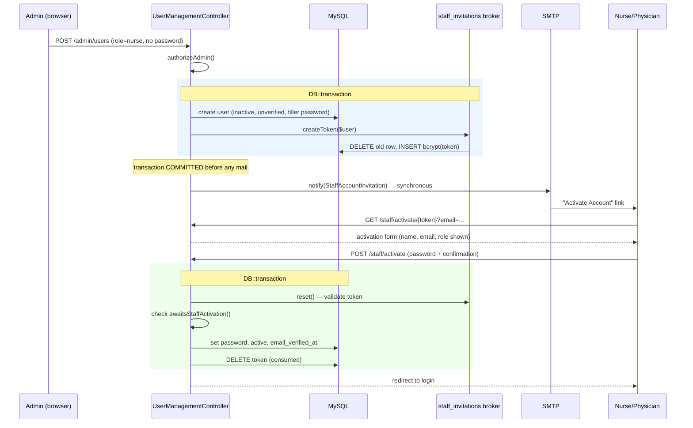

# Staff Account Invitation System

## 1. Overview

Nurses and physicians cannot register themselves in Telemed, and an administrator never chooses their password. Instead, an admin **provisions** the account and the system emails the staff member a one-time link; the staff member sets their own password through that link, and doing so is what activates the account.

The feature exists to close a specific security gap. The obvious implementation — an admin types a password into a form and tells the nurse what it is — creates a credential that at minimum two people know, that travels through a chat message or a sticky note, and that the system can never prove was changed. For a telemedicine system where a nurse or physician account can read patient symptoms, prescriptions, and consultation transcripts, that is not acceptable.

**The design principle:** the only person who ever knows a staff member's password is the staff member. The admin's authority is to *create the account and grant the role*, not to hold the credential.

**Two roles use this flow:** `nurse` and `physician`. Patients self-register ([RegisteredUserController](../app/Http/Controllers/Auth/RegisteredUserController.php)); admins are provisioned directly. Neither can use the invitation flow, and the system enforces that from the database record, not from the form.

**Built on Laravel's password broker, not a custom token system.** This is the single most important architectural decision in the feature and Section 4 explains why.

---

## 2. Architecture



**Division of responsibility:**

- **Laravel's password broker** owns the cryptography: token generation, hashing, expiry arithmetic, single-use consumption, and rotation. None of this is hand-written.
- **The application** owns the business rules the broker knows nothing about: *who* is eligible to activate, *who* may resend, and what activation actually changes on the user record.

That split is deliberate. The broker cannot be trusted to know that a suspended account must not be resurrected — it only knows whether a token matches. Conversely, the application should never be trusted to reinvent token hashing.

---

## 3. Data Model

### `staff_invitation_tokens`

[Migration](../database/migrations/2026_08_25_000000_create_staff_invitation_tokens_table.php)

```php
Schema::create('staff_invitation_tokens', function (Blueprint $table) {
    $table->string('email', 150)->primary();
    $table->string('token');
    $table->timestamp('created_at')->nullable();
});
```

| Column | Purpose |
|---|---|
| `email` | Primary key. At most one live invitation per address. |
| `token` | **bcrypt hash** of the token. The plaintext is never stored. |
| `created_at` | Expiry is computed from this; there is no `expires_at` column. |

**Why exactly these three columns — and why no `user_id`?** Laravel's `DatabaseTokenRepository::getPayload()` inserts precisely `['email', 'token', 'created_at']`. Adding any `NOT NULL` column without a default breaks that insert. This is *why* invitations are email-keyed rather than user-keyed, and it is the root cause of the vulnerability described in Section 8.

### Relevant `users` columns

| Column | Role in this feature |
|---|---|
| `user_id` | Primary key (non-standard; the project does not use `id`). |
| `email` | Links a user to their invitation. Unique. |
| `role` | `patient` / `nurse` / `physician` / `admin`. |
| `account_status` | `inactive` / `active` / `suspended`. Invited staff start `inactive`. |
| `email_verified_at` | `null` until activation. |
| `password` | `NOT NULL`, so an invited account stores a discarded random filler. |

**No new columns were added to `users`.** Invitation state is *derived*, never stored — see Section 10.

---

## 4. Why Laravel's Password Broker

The intuitive design is a `staff_invitations` table with `user_id`, `token`, `expires_at`, `accepted_at`, `revoked_at`. That was rejected.

Laravel supports **multiple named password brokers**. Adding a second one gives the entire token lifecycle for free:

```php
// config/auth.php
'staff_invitations' => [
    'provider' => 'users',
    'table'    => 'staff_invitation_tokens',
    'expire'   => 10080,   // minutes = exactly 7 days
    'throttle' => 60,      // seconds; guards against double-clicks
],
```

| Requirement | Handled by |
|---|---|
| Cryptographically random token | `hash_hmac('sha256', Str::random(40), APP_KEY)` |
| Hashed at rest | `Hash::make()` inside `getPayload()` |
| 7-day expiry | `expire => 10080` |
| Single-use | `reset()` deletes the token after the callback |
| Rotation on reissue | `create()` calls `deleteExisting()` **before** inserting |
| Revocation | `deleteToken()` |

The custom table's extra columns map onto existing concepts: `accepted_at` is already `users.email_verified_at`; `revoked_at` is a deleted row; `expires_at` is `created_at + expire`. Only `created_by` would have been genuinely new — and no requirement called for it.

**A second broker was required, not just reuse of the existing one.** Expiry is configured *per broker*. Sharing the `users` broker would have stretched every ordinary password reset from 60 minutes to 7 days — a security regression for every patient in the system.

**Broker isolation is enforced and tested:** a staff invitation token is rejected by the password-reset flow, and a password-reset token is rejected by activation, because each broker reads a different table.

---

## 5. Account Creation

[`UserManagementController::store()`](../app/Http/Controllers/Admin/UserManagementController.php)

The controller branches on the submitted role. For `nurse`/`physician`:

- The `password` validation rule **is not applied at all** — the form does not collect one.
- `account_status` is restricted to `['nullable', 'in:inactive']`, so an admin submitting `active` gets a **validation error**, not a silent downgrade.
- The account is forced to `account_status = inactive`, `email_verified_at = null`, `online_status = offline`.

```php
$payload += [
    'password' => Hash::make(Str::random(64)),
    'account_status' => 'inactive',
    'email_verified_at' => null,
];
```

**On the filler password.** `users.password` is `NOT NULL`, and the schema was not to be changed. This is *not* a temporary password: the plaintext is generated inline and immediately discarded, so nobody — including the admin and including the database — ever knows it. Login is blocked by `account_status` regardless, and activation overwrites it.

### Transaction boundary

```php
[$user, $invitationToken] = DB::transaction(function () use ($payload, $invited): array {
    $user = User::create($payload);
    $token = $invited ? Password::broker('staff_invitations')->createToken($user) : null;
    return [$user, $token];
});

// ... COMMITTED here ...

$user->notify(new StaffAccountInvitation($user, $invitationToken));
```

The account and its invitation commit together — an account can never exist without a usable invitation. Mail is sent **after** commit, never inside the transaction, because holding a database transaction open across a network call to an SMTP server is a recipe for lock contention and timeouts.

---

## 6. The Invitation Email

[`StaffAccountInvitation`](../app/Notifications/StaffAccountInvitation.php) — a standard Laravel mail notification.

The activation URL is built with the **named route**, never a hardcoded path:

```php
route('staff.activate', ['token' => $this->token, 'email' => $this->user->email]);
// → /staff/activate/{token}?email=...
```

The token is a path segment; the email rides along as a query parameter because the broker looks invitations up by email (Section 3).

**The email contains:** the recipient's name, their role, who created the account, an "Activate Account" button, the 7-day expiry, and guidance if the invitation was unexpected. **It does not contain:** any password, any hash, any database ID, or the token anywhere other than inside the link.

### Why the notification is deliberately NOT queued

`QUEUE_CONNECTION=database`. A queued notification serialises its constructor arguments — including the **plaintext token** — into `jobs.payload`, where it would sit in the database until a worker picked it up. That would persist in the clear precisely the value `staff_invitation_tokens` deliberately stores only as a hash.

Laravel's own `ResetPassword` notification makes the identical choice for the identical reason. A regression test asserts the class does not implement `ShouldQueue`, so this cannot be undone by accident.

---

## 7. Activation

[`StaffInvitationController`](../app/Http/Controllers/Auth/StaffInvitationController.php)

| Route | Middleware |
|---|---|
| `GET /staff/activate/{token}` | `web`, `guest`, `throttle:6,1` |
| `POST /staff/activate` | `web`, `guest`, `throttle:6,1` |

These are **guest** routes and deliberately sit outside the `auth`+`verified` group in [routes/web.php](../routes/web.php) — the invitee has no password yet and cannot possibly be logged in.

The `GET` route validates the token *before* rendering, because the page displays the invitee's name and role. Rendering that without checking the token would leak personal data to anyone guessing an email address.

### The POST flow

```php
$status = DB::transaction(fn () => $this->broker()->reset(
    $request->only('email', 'password', 'password_confirmation', 'token'),
    function (User $user) use ($request): void {
        if (! $this->isEligible($user)) {
            $this->reject();
        }
        $user->forceFill([
            'password'          => Hash::make($request->string('password')->toString()),
            'account_status'    => 'active',
            'email_verified_at' => now(),
            'remember_token'    => Str::random(60),
        ])->save();
    }
));
```

**Eligibility is checked inside the broker's callback, not before it.** This ordering is a security decision. `PasswordBroker::reset()` validates the token *first*; only then does it invoke the callback. Checking eligibility earlier would let anyone who guesses an email address discover whether it belongs to a pending, active, or suspended account — an account-status oracle. Inside the callback, the check only runs for someone who has already proven they hold a genuine invitation.

**Rejection is a `ValidationException` thrown from inside the transaction.** It rolls the transaction back (so the token is *not* consumed by a failed attempt) and Laravel renders it as a normal form error. Laravel's `Timebox` re-throws it after padding the elapsed time, so the ineligible path takes the same wall-clock time as the invalid-token path — closing a timing side channel too.

**All eight rejection reasons return the identical message:** invalid token, expired token, revoked token, already-consumed token, active account, suspended account, missing user, wrong role. Distinguishing them would leak account state.

**Activation never touches `role`.** It is read from the stored record and never from the request — a POST carrying `role=admin` changes nothing.

---

## 8. Email Changes and Stale Invitations

This section documents a **real vulnerability found during audit and fixed**, and is the most likely subject of a defence question.

Because invitations are keyed by `email` (Section 3), and `users.email` is mutable through the admin edit form, an invitation could become detached from its owner:

1. Admin invites Alice at `a@clsu.edu.ph`. Token `T` is stored against that address.
2. Admin corrects a typo, changing Alice's email to `a2@clsu.edu.ph`. **The row for `a@clsu.edu.ph` is orphaned.**
3. Later, a *different* pending nurse, Bob, is assigned `a@clsu.edu.ph`.
4. Anyone still holding Alice's original email clicks the link — and **activates Bob's account, setting Bob's password.**

Every eligibility check passes legitimately, because from the system's point of view this *is* a valid invitation for the account at that address. This was reproduced empirically before being fixed.

### The fix

[`UserManagementController::update()`](../app/Http/Controllers/Admin/UserManagementController.php) revokes the invitation when the email changes:

```php
$emailChanged = $validated['email'] !== $user->email;

DB::transaction(function () use ($user, $validated, $emailChanged): void {
    if ($emailChanged) {
        Password::broker('staff_invitations')->deleteToken($user);   // ← BEFORE fill()
    }
    $user->fill($validated);
    $user->save();
});
```

**Ordering is the entire fix.** `deleteToken()` resolves the address from the model *at call time*. Calling it after `fill()` would delete a row at the **new** address and leave the dangerous one untouched. It runs before `fill()`, while the model still holds the old email, and inside the same transaction so a failed save restores the token.

---

## 9. Resend / Recovery

[`UserManagementController::resendInvitation()`](../app/Http/Controllers/Admin/UserManagementController.php) — `POST /admin/users/{user}/resend-invitation`

Resend exists because the lifecycle has several legitimate dead ends: the invitation expired after 7 days, the first email bounced, the staff member lost it, or an admin corrected the email and (correctly) destroyed the old invitation.

**Authorization layers:** `auth` → `verified` → `throttle:30,1` → `authorizeAdmin()` → database-record eligibility.

Nothing about the target comes from the request body. The user is resolved by **route-model binding**; role and status are read from the row. A POST carrying `role`, `account_status`, `user_id`, or `email` for someone else changes nothing.

### Token rotation

`createToken()` calls `deleteExisting()` **before** inserting, so rotation is atomic inside the repository and **there is never a moment when two invitations are valid**. The previous link dies the instant a new one is issued.

### Concurrency

Two admins clicking Resend simultaneously must not race the delete/insert pair against each other. Following the project's existing convention in [`ConsultationOwnershipService`](../app/Services/ConsultationOwnershipService.php):

```php
DB::transaction(function () use ($user): ?string {
    $locked = User::where('user_id', $user->user_id)->lockForUpdate()->first();

    // Re-checked UNDER the lock: the account may have been activated
    // or suspended since the check above.
    if (! $locked instanceof User || ! $locked->awaitsStaffActivation()) {
        return null;
    }

    return $this->broker()->createToken($locked);
});
```

**This was verified experimentally against real MySQL**, not merely reasoned about. Two independent PHP processes attempted resend on the same account against an isolated MySQL database:

| Scenario | Second process' `SELECT` blocked for |
|---|---|
| With `lockForUpdate()` | **3.26 s** (waited for the first to commit) |
| Control, lock removed | **0.00 s** (no serialisation) |

A second experiment proved the under-lock re-check: while one process held the lock and activated the account, the resend blocked 2.98 s, then found `account_status = active` and issued **zero** tokens.

> ⚠️ **Known limitation, stated honestly.** The routine Pest suite runs on SQLite (`phpunit.xml`), where `SQLiteGrammar::compileLock()` compiles `lockForUpdate()` to an empty string. Deleting the lock leaves all tests passing. The lock is proven by the MySQL experiment above; it is **not** covered by CI.

### Double-click protection

The broker's own `throttle => 60` is used rather than custom logic:

```php
if ($this->broker()->getRepository()->recentlyCreatedToken($user)) {
    // refuse: an invitation went out moments ago
}
```

This is keyed to the **recipient's address**, so it never blocks an admin inviting several different people in a row. `createToken()` ignores throttle, so account creation is unaffected.

---

## 10. Invitation Status in the Admin UI

The user list shows an **Invitation** column, derived — never stored:

| State | Meaning |
|---|---|
| `Expires in N days` | Live invitation |
| `Expired` | Past 7 days; Resend available |
| `Not sent` | Eligible but no token exists |
| `—` | Not a pending staff account |

Computed from `account_status` + `role` + `staff_invitation_tokens.created_at` in a **single query** (`pluck('created_at', 'email')`), not one per row. A "Resend Invitation" button appears only where the activation flow would actually accept it.

**No status column was added to the database.** A stored status would be a second source of truth able to drift from the tokens the activation flow actually honours.

---

## 11. Authentication Interaction

### Pending staff cannot log in

[`LoginRequest::authenticate()`](../app/Http/Requests/Auth/LoginRequest.php) verifies credentials **first**, then checks status:

```php
if (! Auth::attempt(...)) {
    RateLimiter::hit($this->throttleKey());
    throw ValidationException::withMessages(['email' => trans('auth.failed')]);
}

if (Auth::user()->account_status !== 'active') {
    Auth::guard('web')->logout();
    RateLimiter::hit($this->throttleKey());
    throw ValidationException::withMessages(['email' => 'This account is inactive.']);
}
```

**Why this order matters.** The original code checked status *before* verifying the password, which meant anyone could submit any email and learn from the differing error message whether that address belonged to a non-active account — and because it returned before `RateLimiter::hit()`, they could probe indefinitely. Now a wrong password yields the same generic error regardless of status, status is disclosed only to someone who proved they own the account, and the inactive path consumes the rate limiter.

`Auth::attempt()` logs the user in on success, so the inactive branch immediately calls `logout()`.

### The `email_verified_at` model hook

`User::booted()` originally stamped `email_verified_at = now()` for admin, nurse, **and** physician on every save. That made it impossible for an invited nurse to exist unverified — it silently defeated the whole feature. It was narrowed to admins only, and to `creating` only:

```php
static::creating(function (self $user): void {
    if (empty($user->email_verified_at) && $user->role === 'admin') {
        $user->email_verified_at = now();
    }
});
```

Admins are provisioned directly with no invitation flow, so without this they would be locked out by the `verified` middleware.

---

## 12. Expired Token Cleanup

Registered in [routes/console.php](../routes/console.php):

```php
Schedule::command('auth:clear-resets staff_invitations')->daily()->withoutOverlapping();
```

This is Laravel's **built-in** command — no custom cleanup system. The broker name is mandatory: omitting it targets the default `users` broker and would delete password-reset tokens instead.

**Cleanup provably cannot delete a valid token.** The two boundaries are the same inequality:

- `deleteExpired()` removes rows where `created_at < now() − expires`
- `tokenExpired()` returns true when `created_at + expires < now()`

Anything cleanup deletes is already unusable.

> Requires `php artisan schedule:run` on a cron. Registering the command alone does not make it run.

---

## 13. Routes

| Method | URI | Name | Middleware |
|---|---|---|---|
| `GET` | `admin/users` | `admin.users.index` | `auth`, `verified` |
| `GET` | `admin/users/create` | `admin.users.create` | `auth`, `verified` |
| `POST` | `admin/users` | `admin.users.store` | `auth`, `verified` |
| `GET` | `admin/users/{user}/edit` | `admin.users.edit` | `auth`, `verified` |
| `PUT` | `admin/users/{user}` | `admin.users.update` | `auth`, `verified` |
| `POST` | `admin/users/{user}/resend-invitation` | `admin.users.resend_invitation` | `auth`, `verified`, `throttle:30,1` |
| `GET` | `staff/activate/{token}` | `staff.activate` | `guest`, `throttle:6,1` |
| `POST` | `staff/activate` | `staff.activate.store` | `guest`, `throttle:6,1` |

All admin routes additionally call `authorizeAdmin()` inside the controller, following the project's existing pattern of in-controller role checks rather than middleware.

---

## 14. Security Properties Summary

| Property | Mechanism |
|---|---|
| Admin never knows the password | Filler is random and discarded; invitee sets their own |
| Token unguessable | `hash_hmac('sha256', Str::random(40), APP_KEY)` |
| Token unreadable at rest | bcrypt hash; plaintext never stored |
| Token single-use | Broker deletes it inside the activation transaction |
| Token expires | Exactly 7 days from `created_at` |
| Only one valid token | `createToken()` deletes the previous row first |
| No account enumeration | Uniform rejection message + `Timebox` timing equalisation |
| No status oracle at login | Credentials verified before status is disclosed |
| Role cannot be tampered with | Read from the database record, never the request |
| Target cannot be tampered with | Route-model binding, not request body |
| Suspended accounts cannot be revived | `awaitsStaffActivation()` requires `inactive` |
| Token never persisted | Not in `users`, `jobs`, session, flashed input, or logs |
| Token not flashed on error | `$exceptions->dontFlash(['token'])` in [bootstrap/app.php](../bootstrap/app.php) |
| Brute force bounded | `throttle:6,1` on activation, `throttle:30,1` on resend |
| Concurrent resend safe | `lockForUpdate()` + re-check under lock |
| Mail failure non-destructive | Caught after commit; invitation stays valid |

### The shared eligibility predicate

```php
// app/Models/User.php
public function awaitsStaffActivation(): bool
{
    return $this->account_status === 'inactive'
        && in_array($this->role, self::INVITED_ROLES, true);
}
```

Both activation and resend call this. If the two disagreed, an admin could issue invitations the activation flow would then refuse.

---

## 15. Mail Failure Handling

Mail is sent after commit, so a transport failure cannot roll back a valid account. It is caught:

```php
try {
    $user->notify(new StaffAccountInvitation($user, $invitationToken));
} catch (Throwable $exception) {
    Log::error('Staff invitation email could not be sent.', [
        'user_id'   => $user->user_id,
        'exception' => $exception::class,
    ]);
    return Redirect::route('admin.users.index')->with('warning', '...could not be sent...');
}
```

**Why `Throwable` and not just a mail-transport exception?** The catch exists so a *committed* invitation is not lost behind a 500 error page. A misconfigured mailer throws `InvalidArgumentException`; a broken email template throws a view exception — both have identical recovery needs to an SMTP failure, and both are *more* likely on a fresh deployment. Narrowing the catch would reintroduce the exact bug it was written to fix.

**Only the exception class is logged, never the message.** Symfony's transport exceptions embed the SMTP username in authentication-failure messages, and the notification object carries the plaintext token. Neither belongs in a log file.

The admin sees an honest message — the success flash never claims an email was sent when it was not.

---

## 16. Testing

**130 invitation-specific tests, all passing.** Full suite: 291 passing, 1258 assertions.

| Test file | Cases | Covers |
|---|---|---|
| `StaffInvitationTokenTest` | 11 | Broker config, hashing, expiry, rotation, isolation |
| `StaffAccountActivationTest` | 20 | Activation, all 8 rejection paths, atomicity |
| `StaffAccountCreationTest` | 22 | Admin creation, inactive state, no password |
| `StaffAccountInvitationEmailTest` | 13 | Notification content, URL, not-queued guard |
| `StaffInvitationRevocationTest` | 13 | Email-change revocation (Section 8) |
| `StaffInvitationMailFailureTest` | 6 | SMTP failure recovery |
| `StaffInvitationResendTest` | 29 | Resend, authorization, rotation, throttling |
| `StaffInvitationHardeningTest` | 10 | Login enumeration, throttling, `dontFlash` |
| `StaffInvitationCleanupTest` | 6 | Scheduled expiry cleanup |

**Test discipline:** no test passes a raw token to `expect()`. Validity is asserted through broker calls or `Hash::check()`, so a failing assertion cannot print a live credential into terminal output or CI logs.

**Mutation testing** was used to confirm guards are load-bearing — each security check was temporarily disabled to verify tests actually fail. This is how the `lockForUpdate()` coverage gap was discovered.

---

## 17. Deployment Requirements

| Requirement | Why |
|---|---|
| `APP_URL` = real HTTPS host | **Every activation link is built from it.** A stale dev URL emails dead links. |
| `APP_DEBUG=false` | Debug pages render request data, including the submitted token |
| `APP_ENV=production` | Standard hardening |
| **Stable `APP_KEY`** | Tokens are `hash_hmac(..., APP_KEY)`. **Rotating it invalidates every outstanding invitation and password reset.** |
| Working SMTP + `MAIL_FROM_ADDRESS` | No queue buffer and no automatic retry |
| `php artisan migrate` | Creates `staff_invitation_tokens` |
| Cron running `schedule:run` | Required for expiry cleanup |
| Queue worker | **NOT required** — the notification is synchronous by design |

---

## 18. Likely Defence Questions

**Q: Why not just let the admin set a password?**
Because then two people know the credential, it travels over an insecure channel, and the system can never prove it was changed. For accounts with access to patient clinical data that is unacceptable. The invitation flow guarantees the staff member is the only party who ever knows their password.

**Q: Why use Laravel's password broker instead of your own invitation table?**
Token generation, bcrypt hashing, expiry, single-use consumption, and rotation are all security-critical and all easy to get subtly wrong. The broker is battle-tested framework code. A custom table would have re-implemented it while adding only one genuinely new field (`created_by`), which no requirement asked for.

**Q: Why a second broker rather than reusing the existing one?**
Expiry is configured per broker. Sharing it would have extended every patient password reset from 60 minutes to 7 days.

**Q: Why is the token table keyed by email instead of `user_id`?**
Because `DatabaseTokenRepository` inserts exactly `email`, `token`, `created_at`, and an extra `NOT NULL` column breaks that insert. This is a genuine constraint of reusing the framework — and it caused the vulnerability in Section 8, which is why admin email changes now revoke the invitation first.

**Q: What happens if two admins click Resend at the same time?**
The user row is locked with `lockForUpdate()` and eligibility is re-checked under the lock, so the operations serialise. `createToken()` deletes the old row before inserting, so exactly one invitation is ever valid. This was verified with two real MySQL processes — 3.26 s of measured lock contention versus 0.00 s with the lock removed.

**Q: What if the invitation email fails to send?**
The account and invitation are already committed, so nothing is lost. The failure is caught, the admin sees an honest warning rather than a 500, and the invitation stays valid so it can be resent.

**Q: Could someone brute-force an activation link?**
The token is a 256-bit HMAC. Both activation routes are limited to 6 attempts per minute, and every failure returns an identical message with equalised timing.

**Q: What is the biggest remaining weakness?**
Two, stated honestly. First, `lockForUpdate()` is proven against real MySQL but is not exercised by the SQLite-based test suite, so a future refactor could remove it without any test failing. Second, activation tokens appear in web-server access logs because they are URL path segments — the same tradeoff Laravel's own password reset makes.

---

## 19. Source File Reference

| File | Responsibility |
|---|---|
| [UserManagementController.php](../app/Http/Controllers/Admin/UserManagementController.php) | Admin creation, edit/revocation, resend, status derivation |
| [StaffInvitationController.php](../app/Http/Controllers/Auth/StaffInvitationController.php) | Activation GET/POST, eligibility, token consumption |
| [StaffAccountInvitation.php](../app/Notifications/StaffAccountInvitation.php) | Invitation email; synchronous by design |
| [User.php](../app/Models/User.php) | `awaitsStaffActivation()`, `INVITED_ROLES`, verification hook |
| [LoginRequest.php](../app/Http/Requests/Auth/LoginRequest.php) | Blocks non-active login without enumeration |
| [config/auth.php](../config/auth.php) | `staff_invitations` broker definition |
| [bootstrap/app.php](../bootstrap/app.php) | `dontFlash(['token'])` |
| [routes/web.php](../routes/web.php) · [routes/auth.php](../routes/auth.php) | Admin and guest activation routes |
| [routes/console.php](../routes/console.php) | Scheduled expiry cleanup |
| [create_staff_invitation_tokens_table.php](../database/migrations/2026_08_25_000000_create_staff_invitation_tokens_table.php) | Token table schema |
| [activate-staff-account.blade.php](../resources/views/auth/activate-staff-account.blade.php) | Activation form |
| [admin/users/create.blade.php](../resources/views/admin/users/create.blade.php) · [index.blade.php](../resources/views/admin/users/index.blade.php) | Staff creation form, invitation status + resend |
